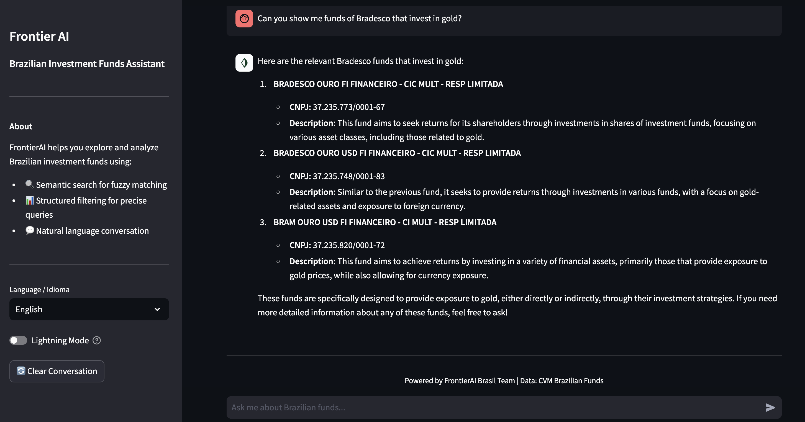
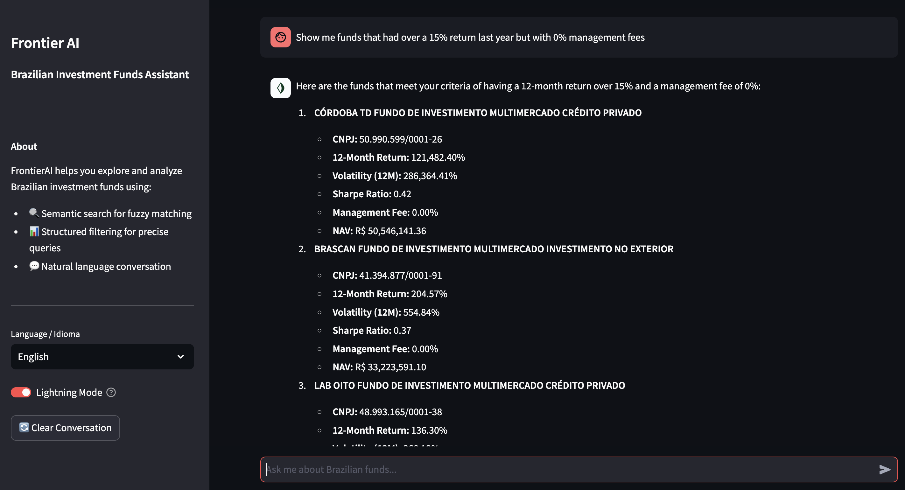
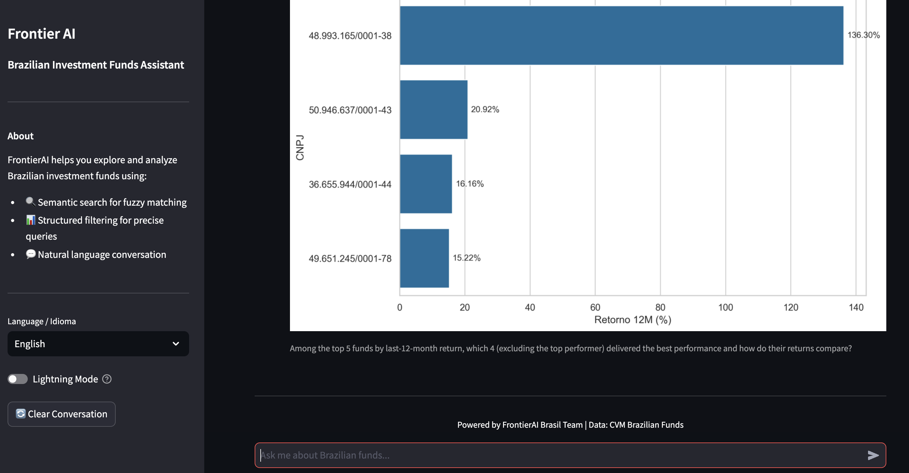
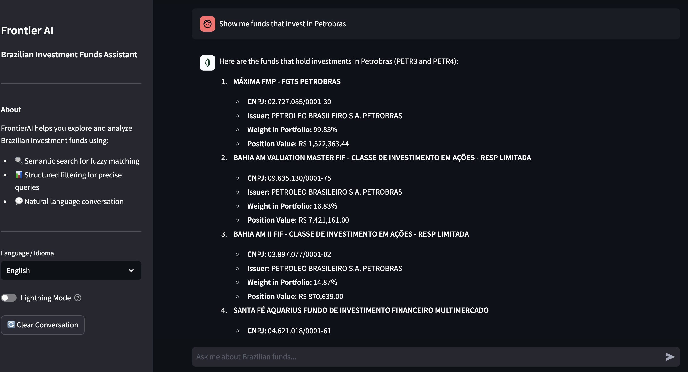
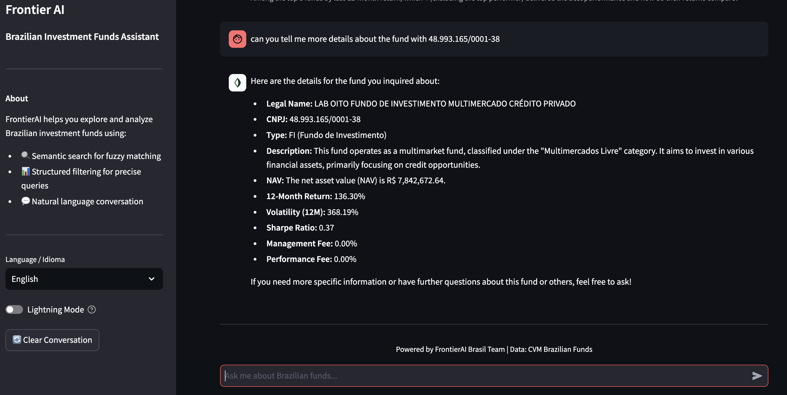

# FrontierAI

<p align="center">
    <em>AI-Powered Brazilian Investment Funds Discovery and Analysis Platform</em>
</p>

[](https://github.com/codingmaster8/frontier-challenge/actions)
[](https://codecov.io/gh/codingmaster8/frontier-challenge)
[](https://badge.fury.io/py/frontier-challenge)

---

**Documentation**: <a href="https://codingmaster8.github.io/frontier-challenge/" target="_blank">https://codingmaster8.github.io/frontier-challenge/</a>

**Source Code**: <a href="https://github.com/codingmaster8/frontier-challenge" target="_blank">https://github.com/codingmaster8/frontier-challenge</a>

---

## Overview

A production-grade conversational AI agent that enables natural language interaction with a comprehensive database of Brazilian investment funds. The system provides intelligent fund discovery, performance analysis, and automated visualization generation using data from CVM (Comissão de Valores Mobiliários).

<p align="center">
  
  <br>
  <em>Natural language fund search with semantic understanding</em>
</p>

## Key Features

**Natural Language Fund Search**: Query funds using conversational language in Portuguese or English. Find funds by name, strategy, manager, or conceptual descriptions like "sustainable technology investing".

**Multiple Search Modes**:
- **Semantic Search**: Vector-based similarity search using OpenAI embeddings and Pinecone for fuzzy, conceptual queries
- **Structured Filters**: Text-to-SQL conversion for precise numeric filtering (returns, fees, AUM, risk metrics)
- **Holdings Search**: Find funds that invest in specific companies or assets with fuzzy matching
- **CNPJ Lookup**: Direct fund retrieval by identifier

<p align="center">
  
  <br>
  <em>Text-to-SQL conversion for precise fund filtering</em>
</p>

**Automated Visualizations**: Generate publication-quality charts and graphs automatically based on data analysis and natural language requests using a multi-stage LangGraph workflow.

<p align="center">
  
  <br>
  <em>Automatic chart generation from natural language queries</em>
</p>

**Complete ETL Pipeline**: Download, process, and load CVM lamina data into DuckDB with optimized views for analytical queries.

**LangGraph Architecture**: Sophisticated agent orchestration with state management, tool routing, error recovery, and conversational memory.

**Production Ready**: Type-safe Pydantic models, comprehensive error handling, retry logic, and extensive test coverage.

## Architecture

```
frontier_challenge/
├── agent/          # LangGraph-based conversational agent
├── tools/          # Specialized search and analysis tools
│   ├── semantic_tool/    # Vector search with Pinecone
│   ├── sql_tool/         # Text-to-SQL for structured queries
│   ├── holdings_tool/    # Portfolio holdings search
│   ├── cnpj_tool/        # Direct CNPJ lookup
│   └── viz_tool/         # Automatic visualization generation
├── ingest/         # ETL pipeline for CVM data
├── db/             # Database view management
└── settings.py     # Configuration and API keys
```


## Technology Stack

- **Database**: DuckDB for analytical workloads
- **Vector Search**: Pinecone with OpenAI embeddings (text-embedding-3-small)
- **Agent Framework**: LangChain/LangGraph for orchestration
- **LLM**: OpenAI GPT models
- **Data Processing**: Pandas for ETL
- **Type Safety**: Pydantic for data validation
- **Web Interface**: Streamlit application

---

## Quick Start

After installing dependencies, having the local db, and having the views created, Just do on your terminal:

```bash
streamlit run app/streamlit_app.py
```

```python
from frontier_challenge.agent import get_financial_agent_graph

# Initialize agent
graph = get_financial_agent_graph(
    db_path="data/br_funds.db",
    model_name="gpt-4o-mini"
)

# Run query
response = graph.invoke({
    "messages": [{"role": "user", "content": "Find large cap equity funds with >15% YTD return"}]
})
```

### More Examples

<details>
<summary>Holdings Search</summary>

<p align="center">
  
  <br>
  <em>Find funds that invest in specific companies</em>
</p>

</details>

<details>
<summary>CNPJ Direct Lookup</summary>

<p align="center">
  
  <br>
  <em>Quick fund information retrieval by CNPJ</em>
</p>

</details>

---


## Development

### Setup environment

We use [uv](https://docs.astral.sh/uv/) to manage the development environment and production build. Ensure it's installed on your system.

### Run unit tests

You can run all the tests with:

```bash
uv run pytest
```

### Format the code

Execute the following command to apply linting and check typing:

```bash
uv run ruff format .
uv run ruff --fix .
uv run mypy frontier_challenge/
```

### Publish a new version

You can bump the version, create a commit and associated tag with one command:

```bash
uv version patch
```

```bash
uv version minor
```

```bash
uv version major
```

Your default Git text editor will open so you can add information about the release.

When you push the tag on GitHub, the workflow will automatically publish it on PyPi and a GitHub release will be created as draft.

## Serve the documentation

You can serve the Mkdocs documentation with:

```bash
uv run mkdocs serve
```

It'll automatically watch for changes in your code.

## License

This project is licensed under the terms of the MIT license.
